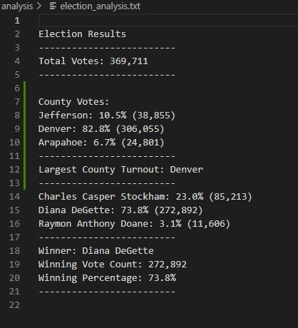

# Election_Analysis

## Project Overview
A Colorado Board of Elections employee provided the following tasks to complete an election audit of a recent local congressional election.

1. Calculate the total number of votes cast.
2. Get a complete list of candidates who received votes.
3. Calculate the total number of votes each candidate received.
4. Calculate the percentage of votes each candidate won.
5. Determine the winner of the election based on popular vote.

## Resources
- Data Source: election_results.csv
- Software: Python 3.10.5,  Visual Studio Code 1.68.1

## Summary
The analysis of the election shows that:

- There were 369,711 votes cast in the election.

- The candidates were:
 
  - Charles Casper Stockham
  - Diana DeGette
  - Raymon Anthony Doane
  
- The Candidate results were:

  - Charles Casper Stockham received 23.0% of the vote and 85,213 votes.
  - Diana DeGette received 73.8% of the vote and 272,892 votes.
  - Raymon Anthony Doane received 3.1% of the vote and 11,606 votes.
  
- The winner of the election was:

  - Diana DeGette, who received 73.8% of the vote and 272,892 votes.
  
## Challenge Overview
For this challenge, the goal was to determine the answers to the following questions:

1. Get a complete list of counties that participated in these particular election results.
2. Calculate the total number of votes from each county.
3. Calculate the percentage of votes each county contributed.
4. Determine the county with the highest voter turnout based on the percentage of votes contributed.

## Challenge Summary
Further analysis of the election results shows that:

- The participating counties were:

  - Jefferson
  - Denver
  - Arapahoe

- The county election participation results were:

  - Jefferson County contributed 10.5% of the votes with 38,855 votes
  - Denver County contributed 82.8% of the votes with 306,055 votes
  - Arapahoe County contributed 6.7% of the votes with 24,801 votes

- The Largest County Turnout came from:
  
  - Denver County which contributed 82.8% of the votes with 306,055 votes
  
  ### Results Printed to Terminal
  
     
  
  ### Results Prnted to Text File
  
   
  
  ### Script Modification Capabilities
  
  The script written to perform the above analyses was designed in a way that it may be easily modified to suit future neads of the election commission.
  We were able to modify the script used in the original assignment to create new variables for counties and their related data and simpley interchange those variable   with a copied version of the script used to find candidate data. The script was not only able to be re-used for new variables within the same data set,  but it may     easily be re-used for future election data sets in a similar manner.  
  
